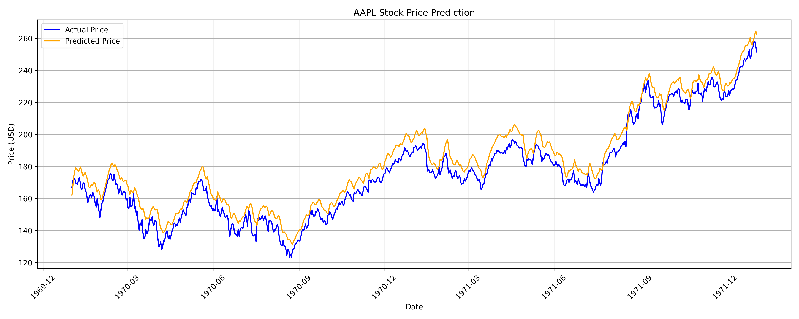

# Stock Price Prediction using LSTM

## Project Overview

This project applies deep learning models (LSTM) to predict Apple stock prices using historical data. The model forecasts the next-day closing price using past price history and technical indicators. The project demonstrates end-to-end data preprocessing, feature engineering, model training, hyperparameter tuning, and evaluation.

## Key Features

- Historical stock price data collection using `yfinance`
- Technical indicator feature engineering (EMA, RSI)
- Data normalization and sequence generation for time series modeling
- LSTM model building and hyperparameter tuning
- Visualization of predictions vs actual prices
- Model evaluation using MSE and MAE

## Project Structure

```
stock-price-prediction/
│
├── data/
│   ├── aapl_raw.csv               # Raw data pulled from yfinance
│   └── aapl_with_indicators.csv   # Data after feature engineering
│
├── notebooks/
│   ├── 01_hyperparameter_tuning.ipynb  # Systematic tuning notebook (exploration)
│   └── 02_final_model.ipynb            # Clean final model notebook (production)
│
├── models/
│   └── final_lstm_model.h5        # Saved trained model
│
├── visuals/
│   └── final_evaluation_plot.png  # Evaluation plot image
│
├── src/
│   └── (optional: modular Python code if you build functions)
│
├── README.md
├── requirements.txt
└── .gitignore
```

## Model Performance

| Metric | Value        |
| ------ | ------------ |
| MSE    | **21.37**    |
| MAE    | **3.75 USD** |

**Best configuration:**

- Units: 100
- Dropout: 0.2
- Batch size: 16
- Epochs: 50

## Visualizations

### Final Evaluation Plot



## Future Improvements

- Try GRU and Bidirectional LSTM models
- Add more technical indicators (MACD, Bollinger Bands, etc.)
- Extend to multi-day forecasts
- Build interactive Streamlit app for live predictions

## Requirements

```
pandas
numpy
yfinance
pandas_ta
scikit-learn
tensorflow
keras
matplotlib
seaborn
statsmodels
pandas_datareader
jupyterlab
```
